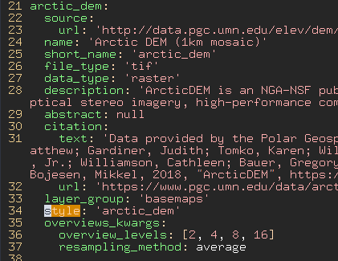

# QGreenland

This project uses a `luigi` pipeline to generate the QGreenland package.


## Pipeline

As of `v0.6.0`:

* Build layers:
    * Coastlines
        * Fetch
        * Unzip
        * Reproject (EPSG:3411)
        * Subset (QGreenland project extent)
    * Arctic DEM
        * Fetch
        * Reproject (EPSG:3411)
        * Subset (QGreenland project extent)
    * IceBridge BedMachine
        * Fetch
        * For each dataset (bed, thickness, surface):
            * Extract dataset
            * Reproject (EPSG:3411) and resample (1km)
* Generate .qgs project file including all layers.
* Create zip file with version in filename, e.g. `QGreenland_v0.6.0.zip`.

NOTE: The full pipeline will not always be enumerated here; just a
representative sample.


## Running the project

The project is run as a docker container stack. It runs Luigi (with visualizer
at port 8082) as a service for running tasks, as well as NGINX for hosting
outputs.

In order to download data behind Earthdata Login, you must provide the
following environment variables on the docker host:

* `EARTHDATA_USERNAME`
* `EARTHDATA_PASSWORD`

Developers at NSIDC may use the values stored in Vault at the following path:
`nsidc/apps/qgreenland`. Those outside of NSIDC must use their personal
Earthdata Login credentials. New users to Earthdata can register here:
https://urs.earthdata.nasa.gov/users/new


### Starting the stack locally

Populate the environment variables with the `export` command, then bring up the
stack:

```
cd luigi
docker-compose up -d
```

### Starting a Luigi pipeline

```
cd scripts/
. run_task.sh
```

The `run_task.sh` script is built to run the entire pipeline. From its example,
you can run individual layer pipelines, e.g.:

```
docker-compose exec luigi \
  luigi --module qgreenland.tasks.layers \
  BedMachineDataset --dataset-name=bed
```

See the [Luigi documentation](https://luigi.readthedocs.io/en/stable/running_luigi.html)
for more information on running Luigi from the CLI.


## Contributing

You can contribute to this project even if you don't have write access by
forking, making your change, making all tests pass, then opening a Pull
Request.

Changes to layer styles can be done without editing Python code.


### Contributing styles

You can contribute style changes without editing any Python code using the
following process:

* Download (or build) and open the most recent version of the project in QGIS.
* In the 'Layers' menu, double click on the layer you wish to edit.
* Open the 'symbology' tab.
* Make your desired style changes.
* In the lower-left corner, click the 'Style' dropdown.
* In this menu, select 'Save Style...'


* Save the style to `qgreenland/styles/<name>.qml` directory of this
  repository. Keep in mind that styles can be shared between layers, so give
  the style a generic name instead of a layer-specific name where possible.
* Edit the `qgreenland/layers.yml` file and find the layer(s) you wish to apply
  this style to. Populate the `style` key for each layer with the name of the
  `.qml` file you saved in the previous step, excluding the extension. For
  example, if you saved `foo.qml`, then populate `style: 'foo'`.




### Contributing metadata

THIS IS CURRENTLY NOT IMPLEMENTED.

The process will likely be the same as contributing styles, except using the
'Metadata' tab in the layer properties, and operating on `.qmd` files.


### Contributing new layers

Add a new class to `qgreenland/tasks/layers.py` for your new layer. Compose
Luigi tasks to build your final QGreenland layer following the example of other
layers.

TODO: Flesh this out more.
