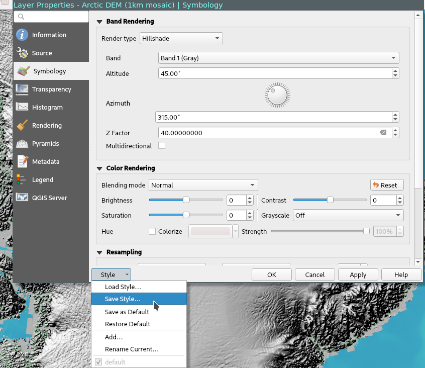

# Greenland-spike

This project uses a `luigi` pipeline to generate the QGreenland package.


## Pipeline

As of `v0.6.0`:

* Build layers:
    * Coastlines
        * Fetch
        * Unzip
        * Reproject (EPSG:3411)
        * Subset (QGreenland project extent)
    * Arctic DEM
        * Fetch
        * Reproject (EPSG:3411)
        * Subset (QGreenland project extent)
    * IceBridge BedMachine
        * Fetch
        * For each dataset (bed, thickness, surface):
            * Extract dataset
            * Reproject (EPSG:3411) and resample (1km)
* Generate .qgs project file including all layers.
* Create zip file with version in filename, e.g. `QGreenland_v0.6.0.zip`.

NOTE: The full pipeline will not always be enumerated here; just a
representative sample.


## Running the project

The project is run as a docker container stack. It runs Luigi (with visualizer
at port 8082) as a service for running tasks, as well as NGINX for hosting
outputs.

In order to download data behind Earthdata Login, you must provide the
following environment variables on the docker host:

* `EARTHDATA_USERNAME`
* `EARTHDATA_PASSWORD`

The correct values can be found in Vault at the path `nsidc/apps/qgreenland`.


### Starting the stack locally

Populate the environment variables with the `export` command, then bring up the
stack:

    cd luigi
    docker-compose up -d


### Starting the stack on a VM

```
vagrant nsidc up --env=dev
```

VM provisioning provides:

  * Earthdata Login credential envvars
  * Running Docker stack
    * Luigi with Visualizer (`:8082`)
    * NGINX hosting outputs (`:80`)
  * 100GiB mounted storage (`/share/appdata/qgreenland`)


### Starting a pipeline

```
cd luigi
. run_task.sh
```

The `run_task.sh` script is built to run the entire pipeline. From its example,
you can run individual layer pipelines, e.g.:

```
docker-compose exec luigi \
  luigi --module qgreenland.tasks.layers \
  BedMachineDataset --dataset-name=bed
```

See the [Luigi documentation](https://luigi.readthedocs.io/en/stable/running_luigi.html)
for more information on running Luigi from the CLI.


### Testing VM outputs with QGIS

There are a couple options here, but each have their tradeoffs.


#### SSHFS

Currently, I think this is the best option for developers on Linux or possibly
Mac (does this work on Mac?).


```
sudo sshfs -F ~/.ssh/config -o IdentityFile=~/.ssh/id_rsa_vagrant_vsphere \
  -o allow_other -o ro \
  vagrant@<vm>:/share/appdata/qgreenland /share/appdata/qgreenland/
```


#### X11 Forwarding

My attempts at X11 Forwarding so far haven't been very fruitful. My best
attempt yielded a QGIS GUI with everything rendered _except_ text.

If you can get X11 Forwarding to work, please update the puppetry and README
for everyone else's edification!


#### Samba?

This will be a bit more work to set up but we could try running Samba in a
docker image.


## Contributing

You can contribute to this project even if you don't have write access by
forking, making your change, making all tests pass, then opening a Pull
Request.

Changes to layer styles and layer metadata can be done without editing
Python code. If you are not comfortable with GitHub, you can e-mail layer
styles and/or metadata files (following the below processes) to the QGreenland
team at `qgreenland@nsidc.org` (?).


### Contributing styles

You can contribute style changes without editing any Python code using the
following process:

* Download (or build) and open the most recent version of the project in QGIS.
* In the 'Layers' menu, double click on the layer you wish to edit.
* Open the 'symbology' tab.
* Make your desired style changes.
* In the lower-left corner, click the 'Style' dropdown.
* In this menu, select 'Save Style...'



* Save the style to `qgreenland/styles/<name>.qml` directory of this
  repository. Keep in mind that styles can be shared between layers, so give
  the style a generic name instead of a layer-specific name where possible.
* Edit the `qgreenland/layers.yml` file and find the layer(s) you wish to apply
  this style to. Populate the `style` key for each layer with the name of the
  `.qml` file you saved in the previous step, excluding the extension. For
  example, if you saved `foo.qml`, then populate `style: 'foo'`.


### Contributing metadata

THIS IS CURRENTLY NOT IMPLEMENTED.

The process will likely be the same as contributing styles, except using the
'Metadata' tab in the layer properties, and operating on `.qmd` files.


### Contributing new layers

Add a new class to `qgreenland/tasks/layers.py` for your new layer. Compose
Luigi tasks to build your final QGreenland layer following the example of other
layers.

TODO: Flesh this out more.
